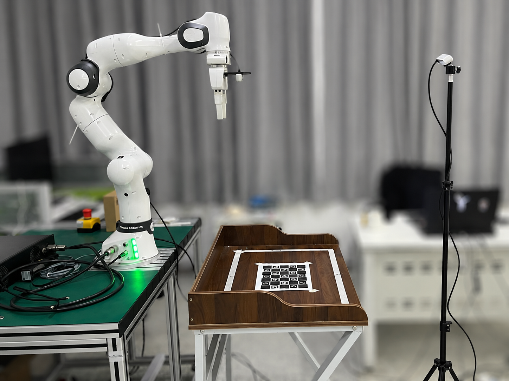
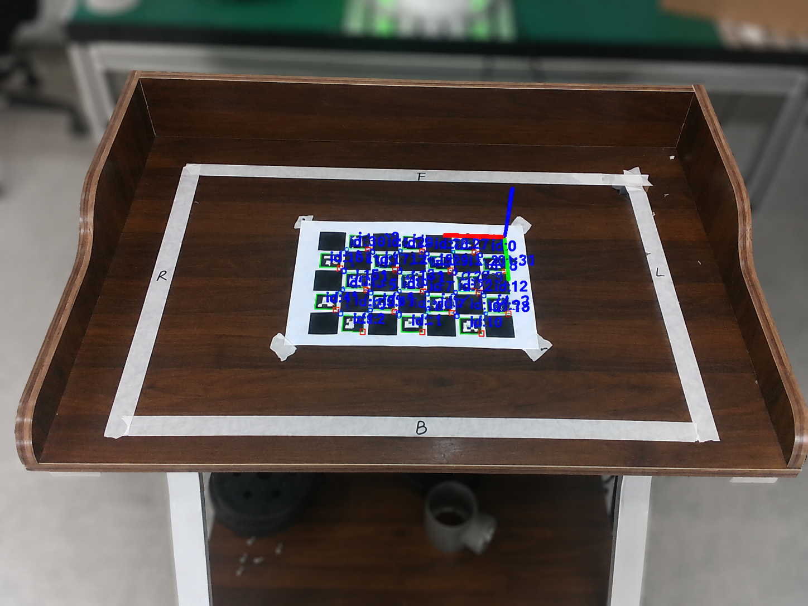

# Franka RealSense VLM Grasp Demo

A ROS 2 Humble robotic grasping demo for Franka FR3 + Intel RealSense.

## Features

- RealSense RGB-D online image acquisition
- Manual grasp point selection
- Manual yaw direction selection
- ChArUco-based external camera calibration
- VLM-assisted multi-object proposal
- Experimental depth/geometric refinement
- MoveIt-based Franka FR3 execution

## Manual Online Grasp

```bash
python3 scripts/online_click_execute_manual_grasp_yaw.py \
  --z_offset 0.030 \
  --depth_radius 5
```

##Operation:

Left click: select grasp center
Right click: select gripper yaw direction
e: execute
u: cancel
q: quit

##VLM-assisted Grasp：
```bash
export DASHSCOPE_API_KEY="your_key_here"
export VLM_API_KEY="$DASHSCOPE_API_KEY"
export VLM_BASE_URL="https://dashscope.aliyuncs.com/compatible-mode/v1"
export VLM_MODEL="qwen-vl-plus"

python3 scripts/online_click_execute_manual_grasp_yaw.py \
  --z_offset 0.030 \
  --depth_radius 5 \
  --vlm_model "$VLM_MODEL"
```
Press g to run VLM-based object proposal.

##Calibration
Camera extrinsic calibration and fixed home joints are robot-specific.

Example files are provided in:

config/examples/

Do not directly reuse another robot's camera extrinsic file.
##Safety
This project controls a real robot. Always verify the grasp pose before execution and keep the emergency stop accessible.
##Roadmap
YOLO / YOLO-seg object detection
Mask-based grasp point refinement
Better multi-object target selection
Grasp result logging## Demo

### System Setup



### Online Grasp Preview



